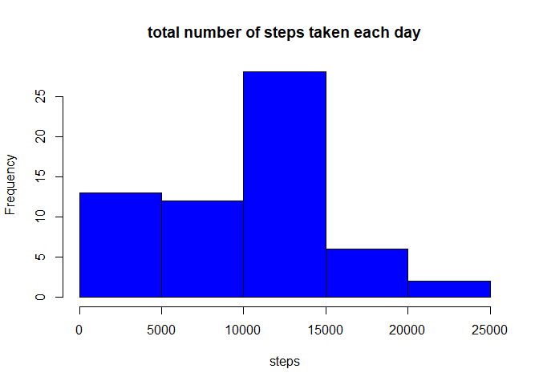
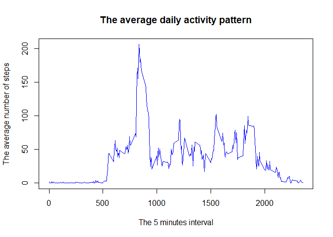
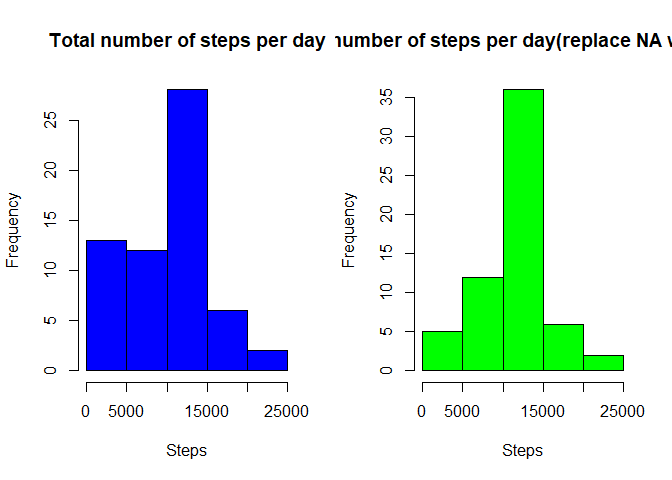
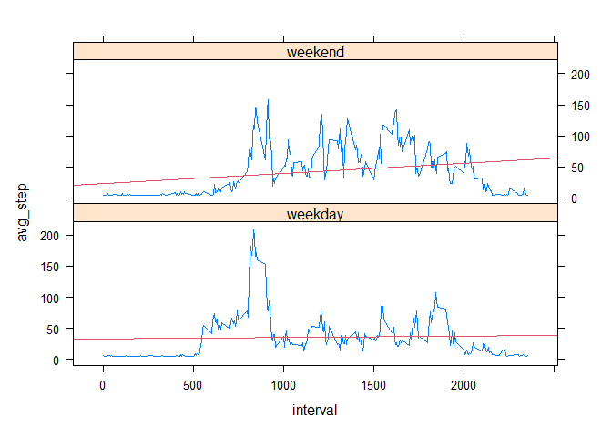

## Loading and preprocessing the data

```r
env=Sys.setlocale("LC_TIME", "English")
library(data.table)
library(dplyr)
library(tidyr)
library(lubridate)
library(ggplot2)
library(lattice)
```

Show any code that is needed to
Load the data (i.e. \color{red}{\verb|read.csv()|}read.csv())
Process/transform the data (if necessary) into a format suitable for your analysis


```r
zip_name <-'activity.zip'

if (!file.exists('activity.csv')){
  unzip(zip_name)
  }
dt<- fread('activity.csv',na.strings='NA') %>% mutate(date=ymd(date))
str(dt)
```

```
## Classes 'data.table' and 'data.frame':	17568 obs. of  3 variables:
##  $ steps   : int  NA NA NA NA NA NA NA NA NA NA ...
##  $ date    : Date, format: "2012-10-01" "2012-10-01" ...
##  $ interval: int  0 5 10 15 20 25 30 35 40 45 ...
##  - attr(*, ".internal.selfref")=<externalptr>
```

## What is mean total number of steps taken per day?  
1. Calculate the total number of steps taken per day  


```r
activity_daily <- dt %>% 
  group_by(date) %>% 
  summarise(steps=sum(steps,na.rm=TRUE))
activity_daily
```

```
## # A tibble: 61 x 2
##    date       steps
##    <date>     <int>
##  1 2012-10-01     0
##  2 2012-10-02   126
##  3 2012-10-03 11352
##  4 2012-10-04 12116
##  5 2012-10-05 13294
##  6 2012-10-06 15420
##  7 2012-10-07 11015
##  8 2012-10-08     0
##  9 2012-10-09 12811
## 10 2012-10-10  9900
## # ... with 51 more rows
```

2. If you do not understand the difference between a histogram and a barplot, research the difference between them. Make a histogram of the total number of steps taken each day

```r
with(activity_daily, 
     hist(steps,
          col='blue',
          main='total number of steps taken each day'
          )
     )
```

<!-- -->

```r
mean_step <- mean(activity_daily$steps)
median_step <- median(activity_daily$steps)
```
3. Calculate and report the mean and median of the total number of steps taken per day  
Above is the total number of steps taken per day.   
Answer: 
  - mean value is : 9354.2295082.   
  - median value is : 10395    

## What is the average daily activity pattern?

1. Make a time series plot (i.e. \color{red}{\verb|type = "l"|}type = "l") of the 5-minute interval (x-axis) and the average number of steps taken, averaged across all days (y-axis)


```r
interval_dt<- dt %>% group_by(interval)%>%summarise(steps=mean(steps,na.rm=TRUE))

with(interval_dt, plot(steps~interval,
              type='l',
              col='blue',
              main='The average daily activity pattern',
              xlab='The 5 minutes interval',
              ylab='The average number of steps'))
```

<!-- -->

```r
max_step_interval <- interval_dt[[which.max(interval_dt$steps),"interval"]]
```
2. Which 5-minute interval, on average across all the days in the dataset, contains the maximum number of steps?

Answer: 835

## Imputing missing values

Note that there are a number of days/intervals where there are missing values (coded as \color{red}{\verb|NA|}NA). The presence of missing days may introduce bias into some calculations or summaries of the data.

Calculate and report the total number of missing values in the dataset (i.e. the total number of rows with \color{red}{\verb|NA|}NAs)

```r
dt %>%summary()
```

```
##      steps             date               interval     
##  Min.   :  0.00   Min.   :2012-10-01   Min.   :   0.0  
##  1st Qu.:  0.00   1st Qu.:2012-10-16   1st Qu.: 588.8  
##  Median :  0.00   Median :2012-10-31   Median :1177.5  
##  Mean   : 37.38   Mean   :2012-10-31   Mean   :1177.5  
##  3rd Qu.: 12.00   3rd Qu.:2012-11-15   3rd Qu.:1766.2  
##  Max.   :806.00   Max.   :2012-11-30   Max.   :2355.0  
##  NA's   :2304
```

```r
total_na <- dt %>% filter(is.na(steps)) %>%summarise(total_na=n())
```
Answer: Total number of missing values in the dataset is 2304.

2. Devise a strategy for filling in all of the missing values in the dataset. The strategy does not need to be sophisticated. For example, you could use the mean/median for that day, or the mean for that 5-minute interval, etc.

```r
# using mean as fill missing value strategy.
mean_step <-mean(dt$steps,na.rm=TRUE) #it should be 37.3826
mean_step
```

```
## [1] 37.3826
```

3. Create a new dataset that is equal to the original dataset but with the missing data filled in.

```r
fill_na_dt <- copy(dt)
setnafill(fill_na_dt, "const",fill=mean_step,cols=c("steps"))
```

4. Make a histogram of the total number of steps taken each day and Calculate and report the mean and median total number of steps taken per day. 

```r
activity_daily_fillna <- fill_na_dt%>% 
  group_by(date) %>% 
  summarise(steps=sum(steps,na.rm=TRUE))
activity_daily
```

```
## # A tibble: 61 x 2
##    date       steps
##    <date>     <int>
##  1 2012-10-01     0
##  2 2012-10-02   126
##  3 2012-10-03 11352
##  4 2012-10-04 12116
##  5 2012-10-05 13294
##  6 2012-10-06 15420
##  7 2012-10-07 11015
##  8 2012-10-08     0
##  9 2012-10-09 12811
## 10 2012-10-10  9900
## # ... with 51 more rows
```


```r
with(activity_daily_fillna, 
     hist(steps,
          col='blue',
          main='total number of steps taken each day'
          )
     )
```

<!-- -->

```r
fillna_mean_step <- mean(activity_daily_fillna$steps)
fillna_median_step <- median(activity_daily_fillna$steps)
```
- Do these values differ from the estimates from the first part of the assignment? 

```r
par(mfrow=c(1,2))
hist(activity_daily$steps,
     main='Total number of steps per day', 
     xlab='Steps',
     col='blue')

hist(activity_daily_fillna$steps,
     main='Total number of steps per day(replace NA with mean)', 
     xlab='Steps',
     col='green')
```

<!-- -->
Answer: Yes. We can see a big change after filled NA value. It is more like normal distribution.

- What is the impact of imputing missing data on the estimates of the total daily number of steps?
  - mean value is : 1.0751738\times 10^{4}.   
  - median value is : 10656 
  
## Are there differences in activity patterns between weekdays and weekends?


```r
activity_wday_type <- copy(dt) %>% 
  setnafill( "const",fill=mean_step,cols=c("steps")) %>%
  mutate(wday=wday(date)) %>%
  mutate(wday_type=factor(case_when(wday %in% c(1,7)~'weekend',
                                    wday %in% c(2,3,4,5,6)~'weekday')
                          )    )%>%
  group_by(interval, wday_type) %>%
  summarize(avg_step=mean(steps))
```

```
## `summarise()` has grouped output by 'interval'. You can override using the `.groups` argument.
```

```r
xyplot(avg_step ~ interval | wday_type, 
       data = activity_wday_type,
      
       layout=c(1,2),
       panel=function(x=interval,y=avg_step,...){
         panel.xyplot(x,y,type='l')
         panel.lmline(x,y,col=2)
         }
       )
```

<!-- -->

```r
#g <- ggplot(activity_wday_type, aes(interval, steps))

#g+geom_line() + facet_grid(rows=var(wday_type))
```
Answer: There is different activity pattern between weekday and weekend. The regressline shows that weekend increase from Moring to dayend. On other hand, the weekday pattern is more stabel in whole days.
