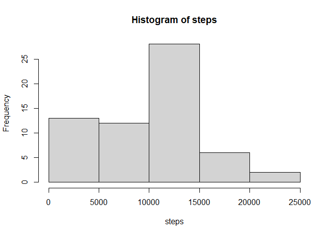

## Loading and preprocessing the data


```r
library(data.table)
library(dplyr)
```

```
## 
## 载入程辑包：'dplyr'
```

```
## The following objects are masked from 'package:data.table':
## 
##     between, first, last
```

```
## The following objects are masked from 'package:stats':
## 
##     filter, lag
```

```
## The following objects are masked from 'package:base':
## 
##     intersect, setdiff, setequal, union
```

```r
library(tidyr)

zip_name <-'activity.zip'

if (!file.exists('activity.csv')){
  unzip(zip_name)
  }
dt<- fread('activity.csv',na.strings='NA')
```

## What is mean total number of steps taken per day?

```r
steps_daily <- dt %>% 
  group_by(date) %>% 
  summarise(steps=sum(steps,na.rm=TRUE))
# histgram plot total steps pattern
with(steps_daily, hist(steps))
```

<!-- -->

```r
mean_step <- mean(steps_daily$steps)
median_step <- median(steps_daily$steps)
```
Above is the total number of steps taken per day. The mean value is : 9354.2295082, the median value is : 10395
## What is the average daily activity pattern?


## Imputing missing values


## Are there differences in activity patterns between weekdays and weekends?
